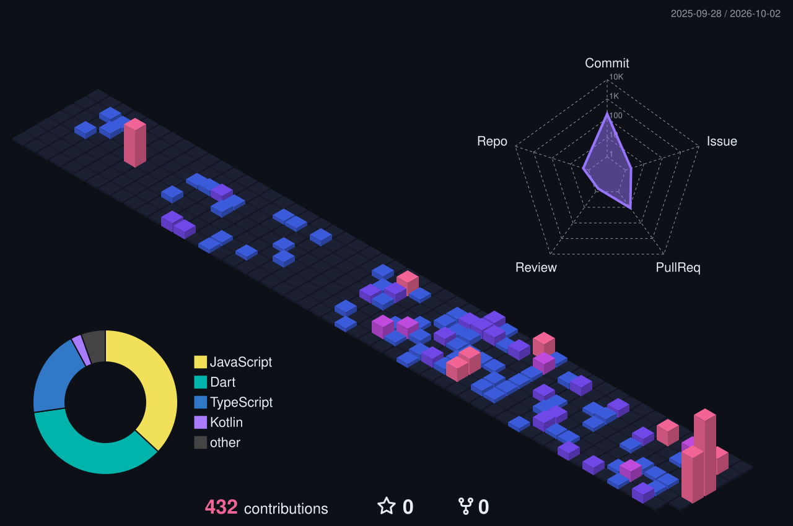

  

---

### Sobre mí

Full Stack Developer con 3 años de experiencia en Python, C# y .NET, especializada en el ecosistema Odoo (v15–v19): módulos a medida, migraciones entre versiones, integraciones con otros sistemas (pasarelas de pago, APIs externas), e-commerce y automatización de procesos.

English

 
Full Stack Developer with 3 years of experience in Python, C#, and .NET, specialized in the Odoo ecosystem (v15–v19): custom modules, version migrations, integrations with external systems (payment gateways, third-party APIs), e-commerce, and process automation.

Deutsch

 
Full Stack Entwicklerin mit 3 Jahren Erfahrung in Python, C# und .NET, spezialisiert auf das Odoo-Ökosystem (v15–v19): individuelle Module, Versionsmigrationen, Integrationen mit externen Systemen (Zahlungsanbieter, externe APIs), E-Commerce und Prozessautomatisierung.

---

### Stack

---

### Contribuciones

<picture>
  <source media="(prefers-color-scheme: dark)" srcset="profile-3d-contrib/profile-custom-dark.svg" />
  <source media="(prefers-color-scheme: light)" srcset="profile-3d-contrib/profile-custom-light.svg" />
  
</picture>

---

### Contacto

Escríbeme para proyectos de Odoo, integraciones o desarrollo en .NET.

 

&nbsp;&nbsp;

